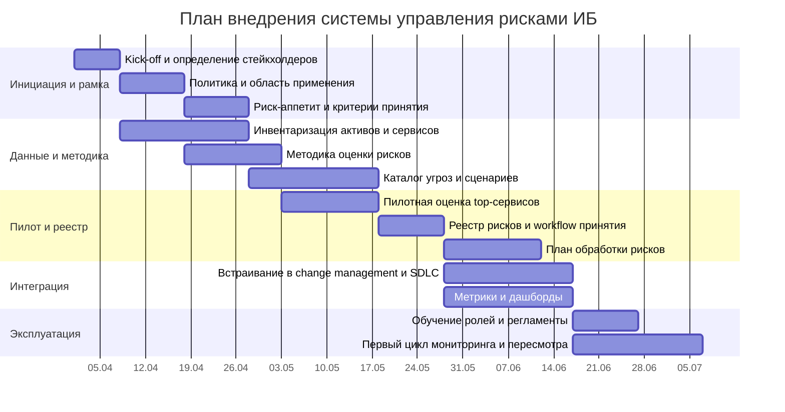

# Управление рисками в защите информации: подходы и структура системы управления рисками

## Executive summary

Управление рисками в защите информации имеет смысл только тогда, когда оно помогает принимать решения. Если свести тему к перечню ГОСТов, стандартов и методик, то теряется главное: риск-менеджмент нужен не ради документов, а ради ответа на очень практичные вопросы. Какие активы для организации критичны? Какие угрозы действительно опасны? Где ущерб будет максимальным? Что надо сделать прямо сейчас, а что можно принять как допустимый остаточный риск?

Поэтому в центре разговора должна быть не номенклатура стандартов, а логика работы с риском. Сначала организация определяет контекст: какие процессы и системы для нее важны, какие данные чувствительны, какие требования обязательны по закону и регуляторике. Затем она описывает сценарии угроз, оценивает вероятность и последствия, выбирает меры обработки риска, назначает ответственных и выстраивает цикл регулярного пересмотра. В таком виде риск-менеджмент становится частью управления организацией, а не отдельным бюрократическим процессом.

Для ИБ особенно важен тот факт, что риск не равен ни уязвимости, ни инциденту. Уязвимость показывает слабое место, инцидент показывает уже реализовавшееся событие, а риск связывает угрозу, уязвимость, бизнес-контекст и последствия. Именно поэтому одна и та же техническая проблема в разных организациях может означать совершенно разный уровень риска.

Например, одна и та же неустановленная критическая уязвимость на веб-сервере в интернет-банке и на внутреннем портале небольшой учебной организации формально выглядит одинаково как технический дефект. Но в первом случае она может привести к компрометации счетов, остановке платежей, крупным финансовым потерям и вмешательству регулятора, тогда как во втором последствия чаще ограничатся сбоем вспомогательного сервиса и локальными репутационными издержками. Именно бизнес-функция системы, ценность обрабатываемых данных и масштаб возможного ущерба превращают одинаковую уязвимость в разный по уровню риск.

На практике лучше всего работает комбинированный подход. Сначала проводится широкая качественная оценка, чтобы быстро увидеть общую картину и расставить приоритеты. После этого для наиболее важных сценариев выполняется более детальный анализ, вплоть до количественной оценки, если нужно обосновать бюджет, сравнить варианты защиты или вынести вопрос на уровень руководства. Международные документы ISO и NIST, а в российском контексте также методические материалы ФСТЭК, полезны именно тем, что помогают выстроить этот процесс последовательно и воспроизводимо.

## Нормативная и методическая база

### Российские стандарты и официальные документы

В российской практике документы по управлению рисками ИБ разумно рассматривать как несколько уровней одной системы. На верхнем уровне находятся законы, которые задают обязательный контур: это, прежде всего, Федеральный закон № 149-ФЗ «Об информации, информационных технологиях и о защите информации», Федеральный закон № 152-ФЗ «О персональных данных», а для субъектов критической информационной инфраструктуры еще и Федеральный закон № 187-ФЗ. Эти документы объясняют, почему вопросы риска вообще становятся обязательными для организации.

Следующий уровень образуют документы регулятора. Здесь ключевую роль играет ФСТЭК России, потому что именно ее методические подходы помогают перейти от абстрактного «есть угроза» к понятной рабочей модели: какие объекты подвергаются воздействию, какие сценарии реализации угроз возможны и к каким негативным последствиям они ведут. Практическая ценность этого слоя в том, что он заставляет смотреть не только на перечень мер защиты, но и на сценарии нарушения безопасности. Для организаций, работающих с персональными данными, сюда же добавляется Приказ ФСТЭК России № 21 от 18 февраля 2013 года, который помогает связать оценку рисков с выбором и обоснованием мер защиты.

Третий уровень составляют стандарты, которые помогают организовать сам процесс управления рисками. ГОСТ Р ИСО 31000-2019 задает общий язык риск-менеджмента: что считать риском, как формулировать критерии, почему важно не только оценить риск, но и выстроить мониторинг и коммуникацию. ГОСТ Р ИСО/МЭК 27005-2010 переносит эту логику именно в сферу информационной безопасности и показывает, как связать риск-менеджмент с СУИБ. ГОСТ Р ИСО/МЭК 27004-2021 полезен там, где организации уже недостаточно просто вести реестр рисков и нужен регулярный ответ на вопрос, работают ли меры защиты в реальности. Серия ГОСТ Р 51901 помогает вести риск-регистры и выстраивать скрининговую оценку, а ГОСТ Р 71034-2023 вводит в более прикладную плоскость тему риск-аппетита и ключевых индикаторов риска.

Если говорить проще, российская нормативная база отвечает на три разных вопроса. Законы определяют обязательность и границы ответственности. ФСТЭК задает прикладную логику сценариев угроз и исходных данных для оценки. ГОСТы помогают превратить все это в управляемый процесс, который можно повторять, масштабировать и предъявлять на аудит.

### Международные первоисточники и де-факто стандарты

Международные документы полезны тем, что они лучше раскрывают управленческую и инженерную логику темы. ISO 31000 дает общую рамку риск-менеджмента для любой организации и показывает, что риск должен быть встроен в управление, планирование, отчетность и культуру принятия решений. Для сферы ИБ центральным документом остается ISO/IEC 27005: по состоянию на март 2026 года актуальной международной редакцией является версия 2022 года, и ее ценность в том, что она предлагает структурированный подход к идентификации, оценке и обработке рисков информационной безопасности без жесткого навязывания единственной методики расчета.

Если нужен более выраженный управленческий акцент, полезен ISO/IEC 27014:2020. Этот документ говорит уже не столько о технике оценки, сколько о том, как руководство должно направлять, контролировать и оценивать деятельность по обеспечению ИБ. Для измерений и мониторинга традиционно используют ISO/IEC 27004. Здесь важно понимать, что этот стандарт нужен не ради самих KPI, а ради перехода от субъективного ощущения «кажется, мы контролируем риск» к регулярной проверке эффективности мер и процессов.

Линейка NIST дает еще более прикладной взгляд. NIST SP 800-39 описывает программу управления риском на уровне организации и раскладывает ее на четыре устойчивых элемента: сформировать контекст, оценить риск, ответить на риск и постоянно его мониторить. NIST SP 800-30 детализирует саму процедуру оценки риска и требует явно фиксировать допущения, ограничения и неопределенности. NIST SP 800-37 Revision 2 показывает, как встроить риск-менеджмент в жизненный цикл систем, а актуальная на март 2026 года редакция NIST SP 800-61r3, финализированная 3 апреля 2025 года, подчеркивает, что реагирование на инциденты должно рассматриваться как часть общего управления киберриском, а не как изолированная оперативная функция.

Отдельно стоит отметить OCTAVE и FAIR. OCTAVE удобен там, где организации нужно быстро начать работать со сценариями угроз, критичными активами и бизнес-последствиями без сложной математики. FAIR полезен в обратной ситуации: когда нужно перейти от качественных формулировок к числовой оценке частоты событий и величины потерь. В результате международные подходы можно представить так: ISO помогает построить рамку, NIST хорошо описывает инженерную механику процесса, OCTAVE упрощает запуск сценарной оценки, а FAIR помогает говорить с бизнесом на языке потерь и инвестиций.

## Основные подходы к управлению и оценке рисков

### Термины и «границы» темы

При обсуждении управления рисками ИБ важно сразу развести несколько понятий, которые в практике часто смешиваются. Угроза отвечает на вопрос, что может произойти. Уязвимость показывает, через что это может произойти. Инцидент фиксирует уже состоявшееся событие. Риск же появляется только тогда, когда мы связываем угрозу и уязвимость с ценностью актива, вероятностью реализации и последствиями для организации.

Из этого следует важный практический вывод: высокая техническая критичность сама по себе еще не означает высокий бизнес-риск. Уязвимость с высоким CVSS на изолированном тестовом стенде и та же уязвимость на критичном публичном сервисе имеют разный риск-профиль. Поэтому грамотная оценка риска всегда требует контекста, а не только технических метрик.

### Качественные подходы

Качественная оценка применяется тогда, когда организации нужно быстро получить рабочую картину рисков без тяжелой аналитики. Обычно для этого используются шкалы уровня вероятности и последствий, матрицы риска, экспертные сессии и сценарные обсуждения. Такой подход особенно полезен на старте, когда у организации еще нет качественных исторических данных, но уже есть понимание процессов, активов и типовых угроз.

Сильная сторона качественного подхода в том, что он позволяет быстро покрыть большой периметр: несколько систем, процессов, подразделений или сервисов. Его слабая сторона состоит в зависимости от качества экспертизы и формулировок. Если шкалы заданы слишком расплывчато, а критерии не закреплены, то результаты становятся плохо сопоставимыми.

### Количественные подходы

Количественная оценка нужна не всегда, но в ряде ситуаций без нее трудно принять зрелое управленческое решение. Она особенно полезна, когда необходимо сравнить несколько вариантов инвестиций, обосновать бюджет, оценить ожидаемые потери или объяснить руководству, почему один сценарий заслуживает большего внимания, чем другой.

Суть количественного подхода в том, что риск пытаются выразить через ожидаемую частоту событий и величину потерь. Для этого используют вероятностные модели, интервальные оценки, сценарные диапазоны и, при достаточной зрелости, методы вроде Monte Carlo. Но у такого подхода есть обязательное условие: организация должна честно работать с неопределенностью. Если данных мало, а цифры выглядят слишком точными, то количественная оценка превращается в псевдоточность.

### Гибридные подходы

Наиболее реалистичным для большинства организаций является гибридный вариант. Сначала выполняется скрининговая качественная оценка, которая помогает быстро выделить действительно важные сценарии. Затем небольшой набор top-рисков переводится в более детальный анализ. Именно так достигается баланс между скоростью, стоимостью оценки и полезностью результата.

Для доклада важно подчеркнуть, что гибридный подход хорош не потому, что он «средний между двумя крайностями», а потому, что он соответствует реальной управленческой практике. Руководству не нужна дорогая количественная модель на весь ландшафт. Ему нужен понятный механизм, который позволяет быстро увидеть общую картину и при этом глубоко разобрать действительно критичные сценарии.

### Обзор ключевых методологий и «где они сидят» в системе

ISO/IEC 27005 лучше всего воспринимать как каркас процесса. Он помогает определить последовательность шагов и встроить риск-менеджмент в СУИБ, но не пытается подменить собой конкретную методику расчета. Поэтому этот подход хорошо подходит организациям, которым нужна воспроизводимая и аудитопригодная рамка.

Связка NIST SP 800-39 и NIST SP 800-30 полезна там, где нужно одновременно видеть и стратегический, и рабочий уровень управления риском. Первый документ описывает программу управления риском в масштабе организации, второй показывает, как именно проводить оценку и как оформлять результаты так, чтобы ими можно было пользоваться повторно.

OCTAVE удобен как сценарный и организационно понятный инструмент. Его преимущество в том, что он быстро связывает риск с критичными активами, процессами и возможными последствиями для бизнеса. Этот подход особенно хорош для пилотных оценок, воркшопов и запуска темы в организациях, где риск-менеджмент ИБ еще только формируется.

FAIR нужен в более зрелой среде, когда вопрос стоит не просто в приоритизации, а в экономическом обосновании. Он помогает говорить о риске как о вероятной величине будущих потерь и делает более содержательным разговор с руководством, финансистами и комитетами по инвестициям.

### Сравнение методологий по критериям

Если убрать академическую форму сравнения, различия между методологиями можно объяснить проще.

- ISO/IEC 27005 подходит тогда, когда организации нужен понятный и масштабируемый процесс, совместимый с СУИБ и аудитом.
- NIST SP 800-39 и SP 800-30 полезны там, где важны дисциплина в допущениях, прозрачность отчета и связка с архитектурой и жизненным циклом систем.
- OCTAVE Allegro хорошо работает для малого и среднего бизнеса, а также для пилотных проектов, потому что позволяет быстро собрать сценарии и расставить приоритеты без тяжелой аналитики.
- FAIR имеет смысл в зрелых организациях, где есть данные, аналитическая культура и потребность переводить риск в язык потерь, диапазонов и инвестиционных решений.

### Критерии выбора подхода

Выбирать метод оценки стоит не по известности названия, а по управленческой задаче.

Если организации нужно быстро навести порядок и охватить весь периметр, лучше начинать с качественного или полуколичественного подхода. Если приоритетом является аудитопригодность и совместимость с СУИБ, логично строить процесс вокруг ISO/IEC 27005. Если организация работает в регулируемой среде или относится к КИИ, критично опираться на официальные сценарии угроз, требования ФСТЭК и воспроизводимые процедуры. Если же вопрос стоит о деньгах, бюджете и сравнении вариантов обработки риска, без элементов количественной оценки уже трудно обойтись.

Перед выбором подхода полезно ответить на несколько фильтрующих вопросов.

- Для какого решения делается оценка: для комплаенса, приоритизации проектов, защиты бюджета или проектирования архитектуры?
- Есть ли у организации риск-аппетит и понятные критерии принятия риска?
- Насколько полны данные об активах, инцидентах, уязвимостях и последствиях простоев?
- Нужна ли доказательная база для регулятора, аудита или совета директоров?

## Структура системы управления рисками ИБ

Ниже описана практическая модель системы управления рисками ИБ. Она полезна тем, что соединяет управленческую логику ISO, инженерную детализацию NIST и российский регуляторный контекст.

### Политика и «рамка» управления риском

Система начинается не с таблицы рисков, а с политического решения организации о том, как именно она управляет риском. Политика управления рисками ИБ не должна быть объемным формальным документом. На практике достаточно компактного документа верхнего уровня, который фиксирует цель, область применения, правила оценки и пересмотра, роли, критерии принятия риска и требования к отчетности.

Минимум, который должен быть зафиксирован в политике:

- зачем организации нужен процесс управления рисками ИБ;
- какие системы, процессы и данные попадают в область применения;
- какая методика используется и как часто пересматриваются оценки;
- кто может принимать остаточный риск и в каких пределах;
- как организованы мониторинг, эскалация и отчетность.

### Процессы цикла управления рисками

Практически весь цикл управления рисками можно описать как пять последовательных шагов.

1. Идентификация. На этом этапе организация определяет активы, информационные потоки, критичные процессы, возможные сценарии угроз и предрасполагающие условия. Здесь особенно важно не ограничиваться перечнем уязвимостей, а строить именно сценарии: кто воздействует, на что, через какой механизм и к чему это приводит.
2. Оценка. Далее риск ранжируется по вероятности и последствиям. На этом этапе полезно заранее определить правило перехода от быстрой скрининговой оценки к детальному анализу, иначе процесс начинает разрастаться без управленческой пользы.
3. Обработка. После оценки выбирается стратегия: снизить риск, избежать его, передать или принять. Важно, чтобы обработка не оставалась словами в отчете, а превращалась в конкретные меры, бюджеты, сроки и владельцев.
4. Мониторинг и пересмотр. Риск-оценка быстро устаревает, если в организации меняется архитектура, поставщики, бизнес-процессы или ландшафт угроз. Поэтому пересмотр должен быть не разовым мероприятием, а встроенным процессом.
5. Коммуникация. Результаты оценки должны доходить до тех, кто принимает решения. Без этого риск-менеджмент превращается в документный архив, который никак не влияет на реальные приоритеты.

### Роли и ответственности

Даже хорошая методика не работает, если в ней не распределена ответственность. Наиболее практичной моделью остается трехлинейный подход.

- Первая линия, то есть владельцы процессов и систем, отвечает за риск в операционной деятельности и за выполнение мер обработки.
- Вторая линия в лице ИБ, риск-функции и комплаенса задает методику, поддерживает процесс, консолидирует результаты и следит за соблюдением правил.
- Третья линия, как правило внутренний аудит, дает независимую оценку того, насколько процесс действительно работает.

Если разложить это на роли внутри организации, то получается достаточно понятная картина. Руководство утверждает риск-аппетит и принимает решения по крупным остаточным рискам. Владелец риска отвечает за практическую обработку. Служба ИБ обеспечивает методологию и связь с СУИБ. ИТ-подразделения поставляют данные об активах, уязвимостях, изменениях и исполняют технические меры. Юристы и комплаенс помогают правильно учитывать регуляторные последствия. SOC и IR-функции обеспечивают обратную связь от инцидентов к пересмотру рисков.

### Метрики и KPI

Метрики в системе управления рисками нужны не для украшения дашбордов, а для проверки двух вещей: насколько стабильно работает сам процесс и насколько реально снижается риск.

Обычно полезно разделять четыре группы показателей:

- метрики процесса, например доля критичных активов с актуальной оценкой;
- метрики обработки, например процент мероприятий, выполненных в срок;
- метрики эффективности мер, например соблюдение SLA по устранению уязвимостей и доля систем с проверенным восстановлением;
- метрики инцидентов, например MTTD, MTTR и число случаев, после которых риск-оценка действительно была пересмотрена.

Здесь важно не допускать типичной ошибки: показатели вроде CVSS или количества найденных уязвимостей сами по себе еще не являются показателями риска. Они полезны как входные данные, но без контекста актива, экспозиции, компенсирующих мер и последствий такие метрики дают только частичную картину.

### Интеграция с СУИБ и жизненным циклом ИТ

Признак зрелой системы управления рисками ИБ состоит в том, что она не живет отдельно от других процессов. Оценка риска должна быть связана с изменениями архитектуры, внедрением новых систем, переходом в облако, развитием DevSecOps, управлением поставщиками и реагированием на инциденты.

На практике это означает следующее. Существенное изменение в системе должно запускать переоценку риска. Проект новой информационной системы должен получать риск-оценку еще на этапе проектирования, а не после запуска. Риски поставщиков и подрядчиков должны попадать в общую картину, а результаты расследований инцидентов должны не просто закрываться отчетом, а менять и оценки, и меры обработки.

### Древовидные схемы для быстрой отрисовки

Ниже приведены шаблонные таксономии. Они полезны не как строгая классификация «раз и навсегда», а как удобный материал для слайдов, схем и рабочих обсуждений.

#### ТИПЫ РИСКОВ ИБ (шаблон)

Риски ИБ
├─ По целям воздействия
│ ├─ Конфиденциальность: утечки, несанкционированное раскрытие
│ ├─ Целостность: подмена данных, мошенничество, искажение
│ ├─ Доступность: простой, DDoS, ransomware
│ ├─ Подотчетность: недостаточность журналирования и следов
│ └─ Неотказуемость: невозможность доказать факт действия
├─ По источнику угроз
│ ├─ Внешние злоумышленники
│ ├─ Внутренние нарушители и ошибки персонала
│ ├─ Поставщики и цепочка поставок
│ ├─ Технические сбои и ошибки конфигурации
│ └─ Природные и чрезвычайные события
├─ По области ИТ
│ ├─ Идентификация и доступ
│ ├─ Сеть и периметр
│ ├─ Конечные точки
│ ├─ Приложения и SDLC
│ ├─ Данные и резервное копирование
│ ├─ Облако и контейнеры
│ └─ Физическая инфраструктура
└─ По последствиям для организации
 ├─ Финансовые потери
 ├─ Правовые и регуляторные последствия
 ├─ Репутационный ущерб
 └─ Риски для людей, производства или экологии

#### ТИПЫ И ПОДТИПЫ МЕР (шаблон)

Меры и стратегии обработки риска
├─ Стратегии обработки
│ ├─ Избежать
│ ├─ Снизить
│ ├─ Передать или разделить
│ └─ Принять
├─ По назначению
│ ├─ Превентивные
│ ├─ Детективные
│ ├─ Корректирующие
│ └─ Восстановительные
├─ По природе
│ ├─ Организационные
│ ├─ Технические
│ └─ Физические
└─ По объекту защиты
 ├─ Доступ
 ├─ Конфигурации и изменения
 ├─ Уязвимости
 ├─ Данные
 ├─ Наблюдаемость
 └─ Реагирование и восстановление

## Практические методы оценки, инструменты и автоматизация

### Методы оценки: от матрицы до вероятностной модели

В рабочей практике удобно двигаться от простого к сложному. На первом уровне организация использует матрицы риска и качественные шкалы. Это помогает быстро ранжировать риски и создать понятный язык обсуждения. На втором уровне появляется сценарный анализ, где внимание переносится с отдельных уязвимостей на цепочки событий и последствия для процесса или сервиса. На третьем уровне, если задача действительно требует точности, подключаются вероятностные модели и количественные оценки.

Особенно полезен сценарный подход. Он заставляет обсуждать риск в форме, удобной для бизнеса: не «у нас есть критическая уязвимость», а «фишинговая компрометация учетной записи может привести к мошенническому платежу», или «ошибка конфигурации в облаке может привести к раскрытию данных». Именно в такой форме риск проще связать с владельцем процесса, последствиями и набором мер.

Если организация использует количественные элементы, правильнее показывать не одно «магическое» число, а диапазоны потерь и частоты. Это делает оценку честнее и лучше отражает неопределенность. Такой подход хорошо сочетается и с идеями NIST, который требует явно фиксировать допущения, и с FAIR, который специально ориентирован на вероятностное представление риска.

Отдельного внимания требует оценка уязвимостей. CVSS, включая актуальную ветку CVSS v4.0, нужен для описания тяжести и характеристик уязвимости, но не заменяет полноценную оценку риска. На практике это означает, что CVSS следует рассматривать как один из входов в контекстную модель, а не как готовый ответ на вопрос о бизнес-приоритете.

### Инструменты и автоматизация: классы ПО и архитектура данных

Автоматизация риск-менеджмента ИБ становится полезной только тогда, когда она соединяет несколько потоков данных, а не просто хранит реестр рисков. Поэтому разумнее говорить не о конкретных брендах, а о классах систем.

Обычно в рабочий контур входят:

- GRC или ISMS-платформа для ведения риск-регистра, согласований и планов обработки;
- CMDB или система учета активов как источник сведений о сервисах и владельцах;
- средства управления уязвимостями как источник технической информации о слабых местах;
- SIEM, мониторинг и SOAR как источник событий и триггеров для пересмотра оценок;
- ITSM или ticketing-система как механизм исполнения мероприятий;
- BI и дашборды как средство отчетности для руководства.

Типовой контур автоматизации можно описать очень просто. Сначала собираются данные об активах, уязвимостях, инцидентах, изменениях и сценариях угроз. Затем данные нормализуются и связываются. После этого рассчитываются показатели, обновляется риск-регистр, запускаются workflow принятия решений и формируется обратная связь для очередного цикла мониторинга. Автоматизация сама по себе не заменяет экспертную оценку, но резко снижает стоимость поддержания процесса в актуальном состоянии.

## План внедрения, кейсы и чек-лист

### Пример пошагового плана внедрения с таймлайном и артефактами

Внедрение системы управления рисками ИБ лучше воспринимать не как разовый проект по написанию документов, а как постепенное выстраивание управляемого процесса. Для малого бизнеса это может быть компактный цикл на полтора-два месяца. Для крупной или регулируемой организации тот же подход растягивается на несколько месяцев из-за интеграций, пилотов и согласований.

Логика внедрения обычно выглядит так: сначала фиксируются цель, область применения и риск-аппетит; затем собираются данные об активах и сценариях; после этого выполняется пилотная оценка, создается реестр рисков, формируется план обработки и только потом процесс встраивается в change management, SDLC и регулярную отчетность.

Если описывать ожидаемые результаты внедрения простыми словами, то к финалу у организации должны появиться политика, методика оценки, критерии принятия риска, каталог сценариев, риск-регистр, план обработки, набор метрик и понятный регламент пересмотра оценок.

### Краткие кейсы инцидентов и как система их обработала

Кейс A: компрометация учетной записи и мошеннический платеж. До инцидента риск был описан как сценарий «фишинг - захват почты - подмена реквизитов». Владелец риска находился в бизнес-процессе платежей, а не только в ИБ. Меры обработки включали MFA, дополнительное подтверждение реквизитов и двойной контроль платежей. Когда инцидент произошел, сработали детективные механизмы, после чего организация не просто ликвидировала последствия, но и пересмотрела вероятность сценария и усилила набор мер.

Кейс B: ransomware в сегменте файловых серверов. Здесь ценность системы управления рисками состоит в том, что до инцидента уже были определены последствия простоя, критичность процесса, целевые меры защиты и требования к восстановлению. Поэтому после атаки организация действовала не вслепую, а по заранее понятной логике: локализация, восстановление, повторная оценка риска, корректировка KPI и контроль того, как реально сработали меры.

Кейс C: утечка данных из-за ошибочной конфигурации облачного хранилища. Такой сценарий хорошо показывает, что современные риски ИБ часто связаны не с «хакером», а с ошибкой настройки, процессом изменения или недостатком автоматических проверок. После устранения инцидента зрелая организация пересматривает не только конкретную конфигурацию, но и весь процесс change management, роли согласования и набор guardrails для облачной среды.

### Практические рекомендации и чек-лист для аудитории

В качестве итогового вывода тему можно свести к нескольким практическим правилам.

1. Начинайте не со списка угроз, а с понимания того, какие решения должна поддерживать ваша система управления рисками.
2. Сразу определяйте область применения, критерии оценки и правила принятия риска, иначе результаты будут несопоставимы.
3. Описывайте риски через сценарии, а не только через перечни уязвимостей и средств защиты.
4. Используйте гибридный подход: широкий скрининг для всего периметра и детальный анализ только для действительно важных сценариев.
5. Назначайте владельцев рисков в бизнесе, а не оставляйте тему исключительно на стороне службы ИБ.
6. Превращайте обработку риска в конкретный план действий со сроками, бюджетом и ответственными.
7. Не путайте тяжесть уязвимости с уровнем риска: техническая критичность без контекста не дает правильного приоритета.
8. Связывайте риск-менеджмент с изменениями, проектированием систем, поставщиками и инцидентами.
9. Измеряйте не только количество проблем, но и то, как меняется фактическая экспозиция риска и эффективность мер.
10. Рассматривайте инциденты как источник обучения: если инцидент не меняет оценку рисков и контрольные меры, система не замкнута.

Для средней и крупной организации к этому списку почти всегда добавляется еще одно правило: роли и линии ответственности должны быть разделены, иначе методология, исполнение и независимая оценка смешиваются и процесс быстро теряет качество.
